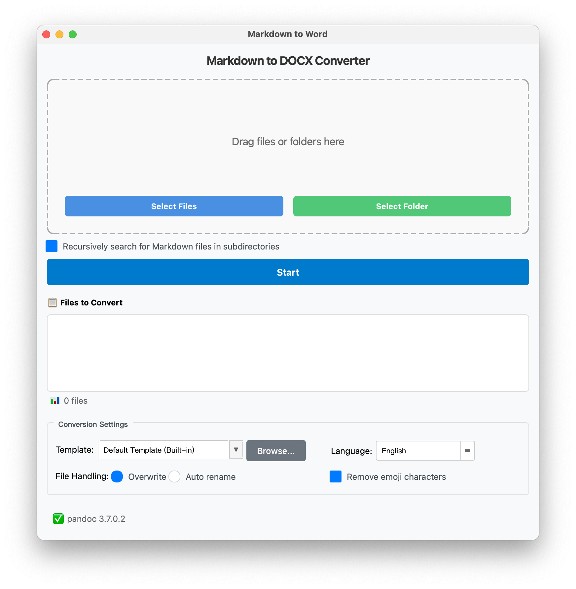

# md2docx - Markdown 转 DOCX 转换器

[](https://www.python.org/downloads/)
[](https://opensource.org/licenses/MIT)
[](https://pypi.org/project/PySide6/)
[](https://github.com/davidjia1972/md2docx/actions)
[](https://github.com/davidjia1972/md2docx/releases)

> [English](README.md) | **简体中文**

一个现代化、用户友好的 GUI 应用程序，用于使用 Pandoc 将 Markdown 文件转换为 DOCX 文档。设计简洁，采用类似 Google 的界面风格，具有强大的批处理功能。



## ✨ 功能特性

- **直观的拖拽界面** - 只需将文件或文件夹拖入应用程序
- **批量转换** - 同时处理多个 Markdown 文件
- **模板支持** - 使用自定义 DOCX 模板保持格式一致性
- **智能文件命名** - 带冲突解决的自动命名（时间戳/递增）
- **表情符号移除** - 专业文档的可选表情过滤功能
- **多语言支持** - 支持 11 种语言
- **实时进度跟踪** - 详细的转换进度反馈
- **递归文件夹扫描** - 自动查找子目录中的 Markdown 文件

## 🌍 支持的语言

- **简体中文** (zh_CN) 
- **English** (en_US)
- **繁體中文** (zh_TW)
- **Français** (fr_FR)
- **Español** (es_ES) 
- **Deutsch** (de_DE)
- **Português** (pt_PT)
- **Русский** (ru_RU)
- **Italiano** (it_IT)
- **日本語** (ja_JP)
- **한국어** (ko_KR)

## 📋 系统要求

### 预编译版本
- **Pandoc** - 文档转换引擎（需要单独安装）
- **现代操作系统**：
  - macOS 10.15+（支持 Intel 和 Apple Silicon）
  - Windows 10+（x64 架构）
  - Linux：现代发行版（Ubuntu 20.04+, Debian 11+, Fedora 35+ 等）

### 源码运行
- **Python 3.8+** - 核心运行环境
- **PySide6** - GUI 框架（通过 requirements.txt 安装）
- **emoji** - 表情处理库（通过 requirements.txt 安装）

**较老 Linux 系统说明**：如果 AppImage 在您的系统上无法运行，可以通过安装依赖后使用 `python src/main.py` 直接运行源码。

## 🚀 快速开始

### 1. 克隆仓库
```bash
git clone https://github.com/davidjia1972/md2docx.git
cd md2docx
```

### 2. 安装 Python 依赖
```bash
pip install -r requirements.txt
```

### 3. 安装 Pandoc

你可以直接下载 Pandoc 的安装文件 [https://github.com/jgm/pandoc/releases](https://github.com/jgm/pandoc/releases)

**macOS:**
```bash
# 使用 Homebrew（推荐）
brew install pandoc

# 或者从官网下载
# https://pandoc.org/installing.html
```

**Windows:**
```bash
# 使用 Chocolatey
choco install pandoc

# 使用 Scoop
scoop install pandoc

# 或者从 https://pandoc.org/installing.html 下载安装包
```

**Linux (Ubuntu/Debian):**
```bash
sudo apt-get install pandoc
```

**Linux (CentOS/RHEL):**
```bash
sudo yum install pandoc
# 或者
sudo dnf install pandoc
```

### 4. 运行应用程序
```bash
python src/main.py
```

## 📖 使用方法

### 基本转换
1. 启动应用程序
2. 将 Markdown 文件或文件夹拖拽到界面中
3. 选择转换选项（模板、文件命名、表情移除）
4. 点击"开始"进行转换

### 模板管理
- **内置模板**: 使用默认模板进行标准格式化
- **自定义模板**: 通过以下方式添加自己的 DOCX 模板：
  - 将 `.docx` 文件复制到 `templates/user/` 目录
  - 使用"浏览..."按钮选择模板文件
  - 模板应包含所需的样式、字体和页面布局

### 文件命名选项
- **覆盖**: 替换同名文件
- **自动重命名**: 添加时间戳或递增数字以避免冲突

### 表情处理
- **移除表情字符**: 转换前自动从 Markdown 中清除表情
- 适用于专业文档和正式文档
- 创建临时清理文件而不修改原文件

## 🏗️ 项目结构

```
md2docx/
├── src/
│   ├── main.py                    # 应用程序入口
│   ├── ui/                        # 用户界面组件
│   │   ├── main_window.py         # 主应用窗口
│   │   ├── drag_drop_area.py      # 拖拽功能
│   │   ├── file_list_widget.py    # 文件列表管理
│   │   ├── output_settings.py     # 转换设置面板
│   │   └── progress_dialog.py     # 进度跟踪对话框
│   ├── converter/                 # 核心转换逻辑
│   │   ├── pandoc_wrapper.py      # Pandoc 命令接口
│   │   ├── batch_converter.py     # 多文件转换引擎
│   │   ├── progress_tracker.py    # 进度监控系统
│   │   └── file_namer.py          # 输出文件命名逻辑
│   ├── utils/                     # 实用工具模块
│   │   ├── config_manager.py      # 配置管理
│   │   ├── emoji_processor.py     # 表情移除和临时文件处理
│   │   ├── file_scanner.py        # Markdown 文件发现
│   │   ├── i18n_manager.py        # 国际化系统
│   │   └── icon_manager.py        # 应用程序图标
│   └── templates/                 # 模板管理
│       └── template_manager.py    # DOCX 模板处理
├── locales/                       # 翻译文件
│   ├── zh_CN/messages.json        # 简体中文翻译
│   ├── en_US/messages.json        # 英文翻译
│   └── [其他语言]/                 # 其他语言包
├── templates/                     # DOCX 模板存储
│   ├── default.docx               # 内置模板
│   └── user/                      # 用户自定义模板
├── config/                        # 配置文件
├── assets/                        # 应用程序资源
│   └── icons/                     # 应用程序图标
└── requirements.txt               # Python 依赖
```

## 🔧 开发

### 架构概述

应用程序采用模块化架构，职责分离清晰：

- **UI 层**: 基于 PySide6 的界面，支持拖拽操作
- **转换引擎**: 使用 Pandoc 的多线程批处理
- **模板系统**: DOCX 模板管理和验证
- **配置**: 基于 JSON 的设置持久化
- **国际化**: 完整的 i18n 系统，支持 11 种语言

### 关键设计模式

- **信号-槽架构**: Qt 信号用于 UI 更新和进度跟踪
- **线程分离**: 后台转换线程防止 UI 阻塞
- **策略模式**: 可配置的文件命名策略
- **模板方法**: 带进度回调的可扩展转换管道

### 添加新功能

1. **UI 更改**: 更新 `src/ui/` 中的相关组件
2. **转换逻辑**: 扩展 `batch_converter.py` 或创建新的转换器模块
3. **设置**: 使用 `config_manager.py` 进行持久化配置
4. **翻译**: 在 `locales/` 中的所有语言文件中添加新键

### 测试和验证

```bash
# 测试 Pandoc 可用性
python -c "from src.converter.pandoc_wrapper import pandoc; print('Pandoc 可用:', pandoc.is_pandoc_available())"

# 验证翻译
python check_translations.py --critical

# 检查图标资源
python check_icons.py
```

## 🌐 国际化

### 添加新语言

1. 创建新目录: `locales/[lang_code]/`
2. 复制 `locales/zh_CN/messages.json` 作为模板
3. 翻译所有键值对
4. 在 `config/languages.json` 中更新新语言条目
5. 使用 `python check_translations.py --lang [lang_code]` 测试

### 翻译指南

- **所有 UI 文本必须使用 i18n 系统** - 不允许硬编码字符串
- **添加新的可翻译文本时更新所有语言文件**
- **在代码中使用 `t()` 函数**: `t("ui.buttons.start")`
- **使用 `check_translations.py` 验证完整性**

### 关键翻译键

所有语言文件中必须包含的基本键：
- 核心按钮 (`ui.buttons.*`)
- 错误消息 (`dialogs.*.title`, `dialogs.*.message`)
- 主要标签 (`ui.labels.*`)
- 文件操作 (`file_operations.*`)

## 🛠️ 维护

### 定期维护任务

1. **翻译更新**: 确保所有语言文件完整且最新
2. **模板验证**: 验证 DOCX 模板未损坏
3. **依赖更新**: 保持 Python 包的安全补丁最新
4. **Pandoc 兼容性**: 测试新版本的 Pandoc

### 常见问题调试

**"Pandoc not found"**:
- 确保 Pandoc 已安装并在系统 PATH 中
- Pandoc 安装后重启应用程序

**模板错误**:
- 检查 `templates/` 目录中 DOCX 文件的有效性和权限
- 验证模板文件未损坏或密码保护

**转换失败**:
- 检查源 Markdown 语法与 Pandoc 的兼容性
- 查看 `logs/converter.log` 中的详细错误信息

**UI 卡顿**:
- 大批量操作应在后台线程运行
- 检查主 UI 线程中的阻塞操作

### 日志文件

应用程序日志存储在 `logs/converter.log`，包含以下详细信息：
- 转换操作和结果
- 错误消息和堆栈跟踪
- Pandoc 命令执行详情
- 模板验证结果

## 📄 许可证

本项目采用 MIT 许可证 - 详见 [LICENSE](LICENSE) 文件。

## 🤝 贡献

欢迎贡献！请随时提交 Pull Request。对于重大更改，请先开启 issue 讨论您想要更改的内容。

### 开发设置

1. Fork 仓库
2. 创建功能分支 (`git checkout -b feature/AmazingFeature`)
3. 进行更改
4. 为新功能添加测试
5. 更新所有支持语言的翻译
6. 提交更改 (`git commit -m 'Add some AmazingFeature'`)
7. 推送到分支 (`git push origin feature/AmazingFeature`)
8. 打开 Pull Request

## 📞 支持

如果遇到任何问题或有疑问：

1. 查看 [Issues](https://github.com/davidjia1972/md2docx/issues) 页面
2. 查阅本 README 的故障排除部分
3. 检查 `logs/converter.log` 中的应用程序日志
4. 创建新的 issue 并提供详细的问题信息

## 🙏 致谢

- [Pandoc](https://pandoc.org/) - 通用文档转换器
- [PySide6](https://pypi.org/project/PySide6/) - Qt for Python
- [emoji](https://pypi.org/project/emoji/) - 表情处理库
- 所有帮助本项目实现多语言化的贡献者和翻译者

---

**注意**: 此应用程序需要单独安装 Pandoc。虽然应用程序在没有 Pandoc 的情况下也能运行，但直到 Pandoc 正确安装并可从系统 PATH 访问之前，转换功能将不可用。